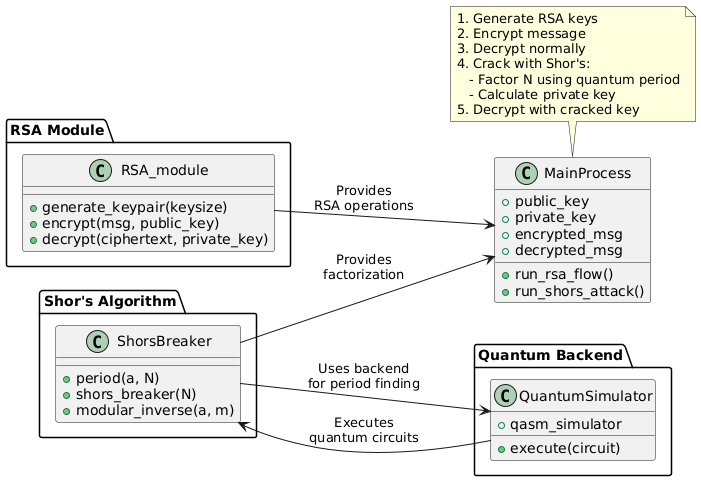

# BreakingWithShorAlgorithm
Shor’s algorithm was invented for integer factorization in 1994.  This algorithm is based on quantum computing and hence referred to as a quantum algorithm. The algorithm finds the prime factors of an integer P. Shor’s algorithm executes in polynomial time which is of the order polynomial in log N. On a classical computer,  it takes the execution time of the order O((log N)3).

It use IBM's Quantum Experience Qiskit module in jupyternotebook for designing the quantum circuit that works on qubits instead of the traditional bits.

Qiskit is an open-source quantum computing software development framework for leveraging today's quantum processors in research, education, and business.

If a quantum computer with a sufficient number of qubits could operate without succumbing to quantum noise and other quantum-decoherence phenomena, then Shor's algorithm could be used to break public-key cryptography schemes, such as the widely-used RSA scheme. RSA is based on the assumption that factoring large integers is computationally intractable.

# RSA_module Explanation
This Python module implements a basic version of the RSA (Rivest-Shamir-Adleman) asymmetric encryption algorithm. RSA is widely used for secure data transmission, employing two keys: a public key for encryption and a private key for decryption.

**Overview of Functions:**

1. gcd(a, b)
   
* Computes the Greatest Common Divisor (GCD) of two integers using the Euclidean algorithm.
* Usage in RSA To determine if two numbers (e and phi) are coprime, which is a requirement in generating the RSA keys.

2. mod_inverse(a, m)

* Finds the modular multiplicative inverse of an integer a modulo m.

* Essential for calculating the private key (d) from the public exponent (e) and phi.

3. isprime(n)

* This implementation contains a logical error. The loop should start from 2 instead of 1, since all numbers are divisible by 1.
* Checks if a number is prime or not.
* Verifying prime numbers when generating RSA key pairs.

4. generate_keypair(keysize)

* Generates RSA public and private key pairs based on a specified bit-length (keysize).
* Randomly selects two prime numbers p and q within specified bit-length constraints.
* Calculates modulus n = p * q. Computes Euler's Totient function: phi = (p - 1) * (q - 1).
* Chooses a random public exponent e that is coprime with phi.
* Calculates private exponent d, the modular inverse of e modulo phi.

5. encrypt(msg_plaintext, package)
* Encrypts a plaintext message using the RSA public key (e, n).
* Each character in the plaintext message is converted to its Unicode integer representation (ord(c)), encrypted individually using modular exponentiation, and stored as ciphertext.

6. decrypt(msg_ciphertext, package)
* Decrypts a ciphertext message back into plaintext using the RSA private key (d, n).
* Each encrypted integer from the ciphertext is decrypted using the private key (d, n) via modular exponentiation and converted back to characters.
