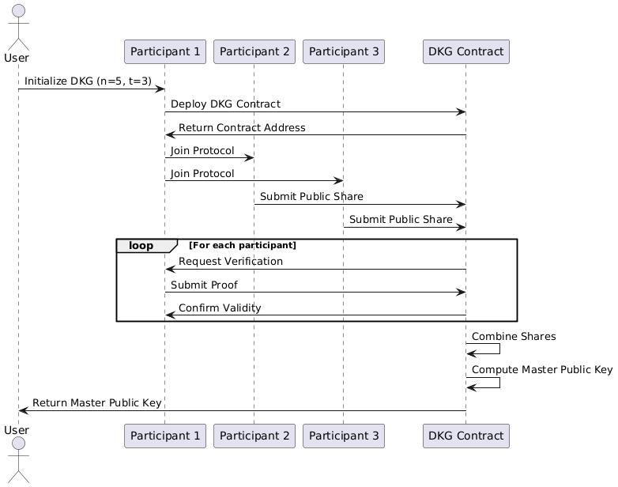

# DKG crypto mechanism in multiSig transactions 

# Protocol Steps Explanation:

**1. Initialization**

* Create a DKG instance with 5 participants and threshold of 3

* Print startup message with participant names

**2. Participant Setup**

* For each participant:

* Generate a random polynomial of degree t-1 (degree 2 in this case)

* Store the polynomial as private shares

* Calculate simple commitments (just for demonstration)

* Calculate public shares for all other participants

* Print the generated polynomial

**3. Share Verification**

* Verify each participant's shares (in this simple version, always returns True)

* Print validation status for each participant

**4. Share Combination**

* For each participant:

* Collect all shares received from other participants

* Sum the received shares

* Print the sum for each participant

* Combine all sums into a master value

* Generate SHA-256 hash of the combined value as the master public key

**5. Output**

* Print the final master public key (SHA-256 hash of combined shares)

# Key Components

**1. Polynomial Generation**

* Each participant creates a random polynomial where:

* The constant term is their secret share

* Degree determines the threshold (t-1)

**2. Share Distribution**

* Each participant evaluates their polynomial at points corresponding to other participants

* Sends these evaluated points as shares to others

**3. Verification**

* In a real implementation, would verify using cryptographic proofs

* This demo skips real verification for simplicity

**3. Key Reconstruction**

* Combines valid shares using Lagrange interpolation (simplified here)

* Produces a master key that requires threshold+1 participants to reconstruct
