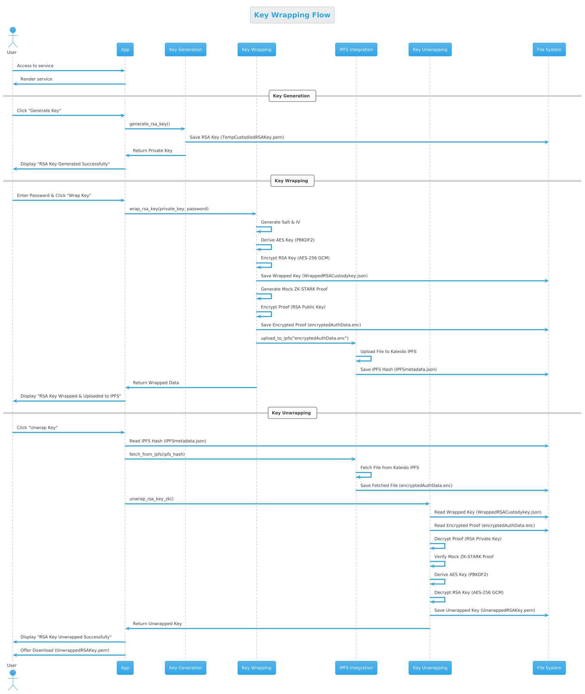

# Key Wrapping
The protection of encryption keys is important, and they often have to be protected. This is especially important for symmetric keys and the private key of a public key pair. Two standards for this are RFC3394 and RFC 5649. These support the Advanced Encryption Standard (AES) Key Wrap algorithm
This project provides a Flask-based web application for generating, wrapping, and unwrapping RSA keys using AES-256 encryption with PBKDF2 key derivation. It also integrates with IPFS for storing encrypted metadata securely.

# Features

1. RSA Key Generation: Generate RSA private keys.

2. Key Wrapping: Encrypt the RSA private key using AES-256 with a user-provided password.

3. Key Unwrapping: Decrypt the RSA private key using the same password.

4. IPFS Integration: Upload and fetch encrypted metadata from IPFS.

5. ZK-STARK Proof (Mocked): Simulate ZK-STARK proof generation and verification for key wrapping/unwrapping.

6. File Downloads: Allow users to download generated keys and metadata.

# Prerequisites

Before deploying this application, ensure you have the following:

1. Python 3.8+: The application is written in Python.

2. Flask: A lightweight web framework for Python.

3. IPFS Credentials: You need valid access to IPFS.

4. Cryptography Library: Install the cryptography library for cryptographic operations.

5. Requests Library: Install the requests library for HTTP requests to IPFS.

# Code Explanation

1. generate_rsa_key(filename="TempCustodiedRSAKey.pem"):

* Generates an RSA private key and saves it to a file.

* Returns the private key object.

2. wrap_rsa_key(private_key, password, output_file="WrappedRSACustodykey.json"):

* Wraps the RSA private key using AES-256 encryption with a user-provided password.

* Saves the wrapped key and metadata to a JSON file.

* Uploads the encrypted metadata to IPFS.

3. unwrap_rsa_key_zk(wrapped_file="WrappedRSACustodykey.json"):

* Fetches the encrypted metadata from IPFS.

* Decrypt the RSA private key using the user-provided password.

* Verifies the ZK-STARK proof (mocked) and returns the unwrapped key.

4. upload_to_ipfs(file_path):

* Uploads a file to IPFS and returns the IPFS hash.

5. fetch_from_ipfs(ipfs_hash, output_file="encryptedAuthData.enc"):

* Fetches a file from IPFS using its hash and saves it locally.

6. save_ipfs_metadata(ipfs_hash, metadata_file="IPFSmetadata.json"):

* Saves the IPFS hash to a metadata file.

7. sign_data(private_key, data=b"signTEST"):

* Signs data using the RSA private key.

8. verify_signature(public_key, signature, data=b"signTEST"):

* Verifies the signature using the RSA public key.

9. save_unwrapped_key(private_key, filename="UnwrappedRSAKey.pem"):

* Saves the unwrapped RSA private key to a file.

# Flask Routes
1. /:

* Renders the home page (index.html).

2. /generate_key:

* Generates an RSA private key and notifies the user.

3. /wrap_key:

* Wraps the RSA private key with a user-provided password and uploads the encrypted metadata to IPFS.

4. /unwrap_key:

* Fetches the encrypted metadata from IPFS, unwraps the RSA private key, and allows the user to download it.

5. /download/<filename>:

* Allows the user to download a file (e.g., the unwrapped RSA key).

# Mock ZK-STARK Proof
* The ZK-STARK proof is mocked for demonstration purposes.
* The proof is generated as a string containing the password and salt.
* The verification checks if the proof starts with "mock_proof"
