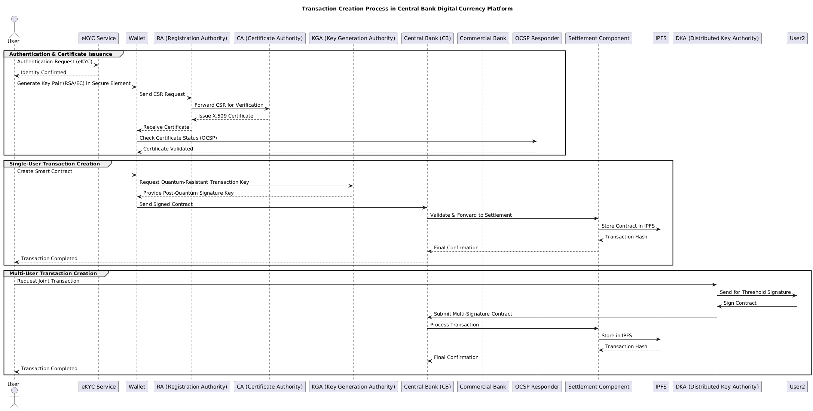

# Thesis-Appendix
Master Thesis Appendix

# Abstract
The development of central bank digital currency, as a digital form of debt issued by central banks, is of interest to countries with different goals and in different formats. Given the wide range of capabilities estimated for central bank digital currency, different goals, methods, and achievements have been proposed for this type of currency, which, in addition to their complete and appropriate implementation, should ensure security in all components involved in credit processes, including the transaction core, service providers and receivers in the banking sector, and service users, in an integrated and sustainable manner.

With the evolution and advancement of quantum computing power, conventional cryptographic algorithms, whose security was proven based on hard mathematical problems such as calculating discrete logarithms or factoring large numbers into prime factors, have been broken in a reasonable amount of time and resources, making their use practically impossible in the coming years; In this regard, post-quantum cryptography refers to a field of cryptography that attempts to encrypt information using hard mathematical problems that are also robust to quantum computing power, so that the security of the information remains resistant to attacks by classical and quantum computers. This cryptography can be implemented without using quantum computers and on current classical systems. 

One of the topics in this field during the transition period is the gradual, safe and easy migration to the use of post-quantum algorithms. In fundamental and vital industries such as the finance and banking industry, the requirements raised regarding the confidentiality, integrity and accessibility of current information such as transactions, make it more urgent to start migrating to new cryptographic algorithms.

In this modeling, one of the approaches that has been registered from a theoretical and practical perspective in implementation is the use of hybrid cryptography, the creation and role of which in the components involved in the implementation of the central bank digital currency platform has been discussed. Also, other protocols and elements involved in the implementation of a secure structure in terms of maintaining confidentiality and integrity of information have been described and used in the model.

